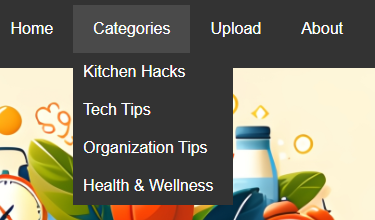
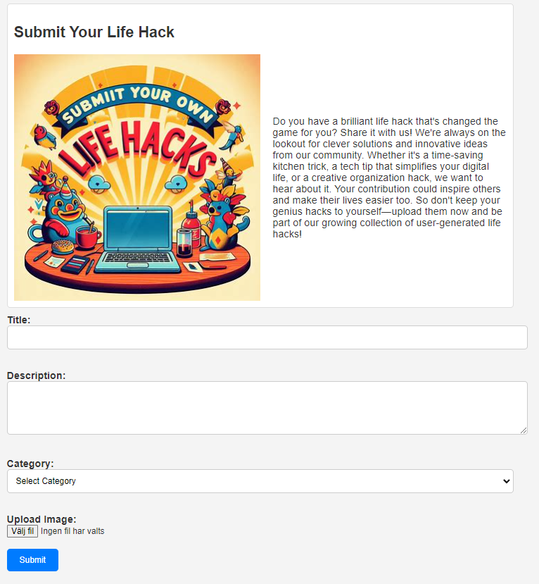
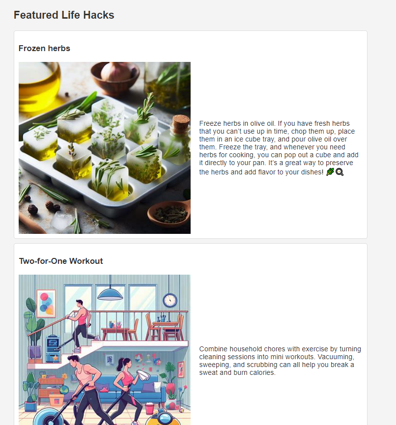
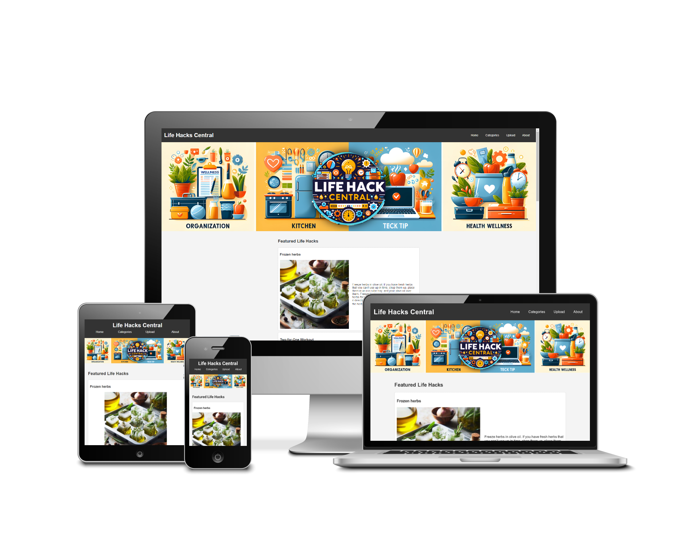

# Life Hacks Central

Life Hacks Central is a website where users can discover and share life hacks to simplify their daily routines. From clever kitchen tricks to innovative tech tips, our platform provides a central hub for users to explore a wide range of practical solutions. Additionally, users can contribute their own life hacks, empowering the community to learn and benefit from each other's insights and experiences.

## Table of Contents

- [Project Description](#project-description)
- [Features](#features)
- [Testing](#Testing)
- [Usage](#usage)
- [Contributing](#contributing)
- [License](#license)

## Project Description
## Purpose:
Life Hacks Central is a web platform designed to streamline and enhance users' daily lives by providing a curated collection of practical tips, tricks, and hacks across various categories. The primary purpose of the website is to serve as a comprehensive resource where individuals can discover innovative solutions to common challenges, ranging from household tasks to personal productivity.

## Goals:
1. **Community Engagement:** Foster a vibrant community of users who actively share, contribute, and benefit from each other's life hacks.
2. **Knowledge Sharing:** Enable users to easily explore and access a diverse range of life hacks across categories such as kitchen, tech, organization, health & wellness, and more.
3. **Empowerment:** Empower users to optimize their daily routines, increase efficiency, and overcome obstacles with creative and practical solutions.
4. **Inspiration:** Inspire creativity and problem-solving by showcasing inventive life hacks and encouraging users to think outside the box.
5. **User-Generated Content:** Provide a platform for users to submit their own life hacks, fostering collaboration and knowledge exchange within the community.

## Development:
Life Hacks Central was developed using modern web technologies including HTML and CSS with a focus on responsive design to ensure optimal user experience across devices. The website features a user-friendly interface with intuitive navigation, allowing users to easily browse and contribute life hacks. Additionally, the development process prioritized scalability and flexibility to accommodate future updates, enhancements, and community-driven features.

## Features
1.  Navigation Menu: Easily navigate through different sections. Featured on all three pages, including Home, Categories, About, and Upload (Submit Your Life Hack) and is identical in each page to allow for easy navigation.

2.  Category Selection: Explore life hacks tailored to your interests with categories like Kitchen Hacks, Tech Tips, Organization Tips, and Health & Wellness.

3.  Life Hack Submission Form: Share your own life hacks effortlessly using the submission form, which includes fields for title, description, and category selection.

4.  Featured Life Hacks: Discover curated life hacks showcased prominently on the main section of the website, complete with titles, descriptions, and illustrative images.

5.  Responsive Design: Enjoy a seamless browsing experience across various devices and screen sizes thanks to the website's responsive design.

6.  Background Images: Immerse yourself in visually captivating backgrounds that correspond to different categories, enhancing the overall aesthetic appeal.

7.  Blur Effect: Experience an aesthetically pleasing backdrop with a subtle blur effect applied to background images, adding depth to the visuals.

8.  Smooth Scrolling: Navigate effortlessly through the website with smooth scrolling behavior, ensuring a pleasant user experience.

9.  Community Engagement: Contribute to a vibrant community by submitting your own life hacks, fostering knowledge sharing and collaboration among users.

## Testing
Overview
Life Hacks Central has undergone extensive testing to ensure all features work as intended and provide a seamless user experience.

Feature Testing
Navigation Bar:

Home, About, Submit Your Life Hack Links: Direct users to the appropriate pages.
Categories Dropdown: Expands and directs to the respective category pages.
Page-Specific Features:

Kitchen Hacks, Tech Tips, Organization Tips, Health & Wellness Pages:
Each article displays correctly with images and descriptions.
Submit Your Life Hack Page:
Form elements function as expected.
Category dropdown pre-selects based on query parameters.
Cross-Browser and Cross-Device Testing
The site was tested on multiple browsers (Chrome, Firefox, Edge, Safari) and devices (desktop, tablet, mobile).

Results:
Consistent layout and functionality across all tested browsers.
Responsive design adapts well to different screen sizes.
Interesting Bugs and Problems
Dropdown Menu on Mobile: Fixed CSS for better compatibility.
Image Loading Times: Optimized image sizes for faster loading on mobile networks.
Validator Testing
HTML and CSS Validation: All pages were validated using W3C services, and all errors were fixed.

  

Conclusion
Comprehensive testing and validation have ensured that Life Hacks Central is user-friendly and performs well across different browsers and devices. Any encountered issues were resolved to enhance overall functionality and user experience.

For detailed information on the testing process, please refer to the [Testing Documentation](TestingDocumentation.txt).

## Usage

Provide instructions on how to use your project. Include examples if applicable.

## Credits

Credits
All code and design elements on this website were created by Hampus Vretinger with assistance from ChatGPT.

Acknowledgements
The design of media elements was facilitated using Co-Pilot Design feature, with subsequent editing and customization performed by Hampus Vretinger.
Showcase image of website on diffrent screens was from "http://www.freepik.com">Designed by macrovector / Freepik

## Contact

Contact me by:
email adress: hampus.vretinger@hotmail.com
